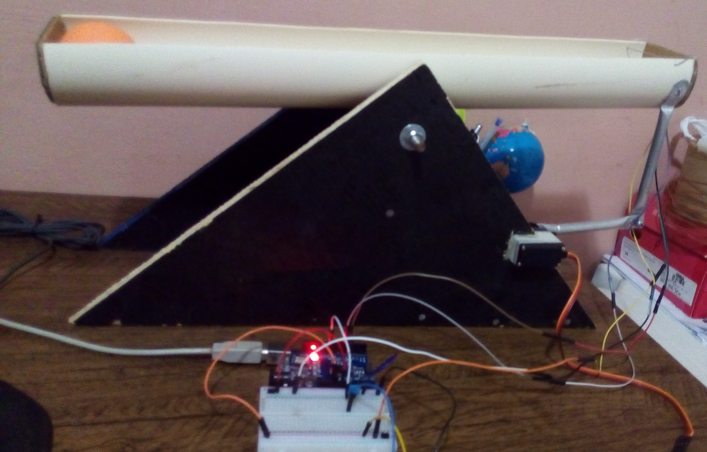
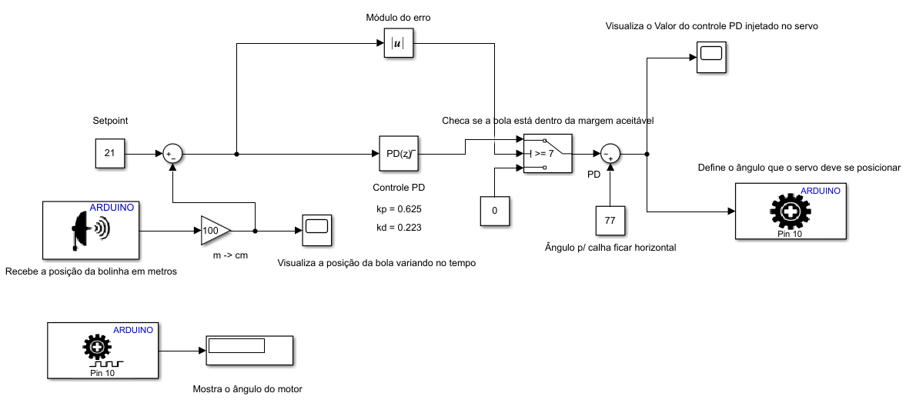

<H1> SISTEMA BOLA-CALHA COM ARDUINO </H1>
Trabalho da disciplina de Sistemas Realimentados. Consiste em controlar a posição de uma bola em uma calha usando um controlador PID com um Arduino e um Servomotor.
A implementação do controlador foi feito de duas maneiras: uma por meio de linha de código, que é mais comum, e a outra forma foi utilizando a ferramenta Simulink da Mathworks.

Dentro da pasta "BallBeamArduinoCode", temos o código utilizado para Arduino.

Dentro da pasta "Simulink", temos o sistema implementado no formato de diagrama de blocos utilizando a ferramenta Simulink.

Protótipo:

Diagrama de Blocos para o Simulink:
